# Source AI System Workflow Diagram

## Complete System Architecture & User Flow

```mermaid
graph TB
    %% User Interface Layer
    subgraph "Frontend Layer"
        ST[Streamlit Dashboard<br/>Port: 8501]
        RN[React Native App<br/>Mobile]
    end
    
    %% API Gateway Layer
    subgraph "Backend Services"
        US[Users Service<br/>Port: 8001<br/>Authentication & Profiles]
        PS[Photos Service<br/>Port: 8002<br/>Photo Management]
        SS[Scheduler Service<br/>Port: 8003<br/>Photo Capture & Scheduling]
    end
    
    %% Data Layer
    subgraph "Data Storage"
        DB[(PostgreSQL<br/>User Data & Metadata)]
        S3[(AWS S3<br/>Photo Storage)]
        REDIS[(Redis<br/>Caching & Sessions)]
    end
    
    %% External Services
    subgraph "External Services"
        CAM[Mac Camera<br/>Photo Capture]
        AWS[AWS S3<br/>Cloud Storage]
    end
    
    %% User Registration Flow
    ST -->|1. Register User| US
    US -->|2. Create User Record| DB
    US -->|3. Hash Password| US
    US -->|4. Return User Data| ST
    
    %% User Login Flow
    ST -->|5. Login Request| US
    US -->|6. Validate Credentials| DB
    US -->|7. Generate JWT Token| US
    US -->|8. Return Token| ST
    
    %% Dashboard Data Flow
    ST -->|9. Get User Stats| US
    US -->|10. Query User Data| DB
    US -->|11. Get Photo Count| SS
    US -->|12. Get Schedule Count| SS
    SS -->|13. Return Photo Data| US
    US -->|14. Calculate Earnings| US
    US -->|15. Update User Balance| DB
    US -->|16. Return Stats| ST
    
    %% Photo Gallery Flow
    ST -->|17. Get Photos| SS
    SS -->|18. Query S3 Photos| S3
    SS -->|19. Return Photo URLs| ST
    
    %% Photo Capture Flow
    ST -->|20. Trigger Capture| SS
    SS -->|21. Initialize Camera| CAM
    CAM -->|22. Capture Photo| CAM
    CAM -->|23. Return Photo Data| SS
    SS -->|24. Upload to S3| AWS
    AWS -->|25. Store Photo| S3
    SS -->|26. Update Capture Session| DB
    SS -->|27. Return Success| ST
    
    %% Scheduled Capture Flow
    SS -->|28. Check Schedules| DB
    SS -->|29. Trigger Scheduled Capture| SS
    SS -->|30. Capture Photo| CAM
    CAM -->|31. Return Photo| SS
    SS -->|32. Upload to S3| AWS
    AWS -->|33. Store Photo| S3
    SS -->|34. Update Schedule| DB
    
    %% Earnings Calculation Flow
    SS -->|35. Photo Captured| SS
    SS -->|36. Notify User Service| US
    US -->|37. Calculate Earnings| US
    US -->|38. Update User Balance| DB
    US -->|39. Update Available Credits| DB
    
    %% Mobile App Flow
    RN -->|40. API Calls| US
    RN -->|41. API Calls| SS
    RN -->|42. API Calls| PS
    
    %% Styling
    classDef frontend fill:#e1f5fe
    classDef backend fill:#f3e5f5
    classDef storage fill:#e8f5e8
    classDef external fill:#fff3e0
    
    class ST,RN frontend
    class US,PS,SS backend
    class DB,S3,REDIS storage
    class CAM,AWS external
```

## Key Workflow Steps

### 1. User Registration & Authentication
1. **User Registration**: Streamlit → Users Service → Database
2. **Login**: Streamlit → Users Service → JWT Token Generation
3. **Profile Access**: JWT Token → Users Service → User Data

### 2. Dashboard Data Flow
1. **Stats Calculation**: Users Service queries multiple services
2. **Photo Count**: Users Service → Scheduler Service → S3
3. **Earnings**: Automatic calculation based on photos captured
4. **Schedule Status**: Users Service → Scheduler Service → Database

### 3. Photo Capture Process
1. **Manual Capture**: Streamlit → Scheduler Service → Mac Camera
2. **Scheduled Capture**: Scheduler Service → Automatic triggers
3. **Storage**: Photos uploaded to AWS S3
4. **Metadata**: Capture sessions stored in database

### 4. Earnings System
1. **Photo Captured**: Scheduler Service notifies Users Service
2. **Earnings Calculation**: $0.50 per photo captured
3. **Balance Update**: User's incentive balance updated in database
4. **Real-time Display**: Dashboard shows updated earnings

### 5. Photo Gallery
1. **Photo Retrieval**: Streamlit → Scheduler Service → S3
2. **URL Generation**: S3 URLs returned for photo display
3. **Metadata**: Photo information from S3 and database

## Service Responsibilities

### Users Service (Port 8001)
- User authentication and authorization
- Profile management
- Earnings calculation and tracking
- JWT token generation and validation

### Photos Service (Port 8002)
- Photo metadata management
- Photo processing and analysis
- Photo gallery API endpoints

### Scheduler Service (Port 8003)
- Photo capture orchestration
- Schedule management
- S3 integration
- Camera control
- Background task processing

## Data Flow Summary

1. **User registers** → Users Service creates account
2. **User logs in** → JWT token generated
3. **Dashboard loads** → Stats calculated from multiple services
4. **Photos captured** → Stored in S3, metadata in database
5. **Earnings updated** → Real-time balance calculation
6. **Gallery displays** → Photos retrieved from S3

## Key Features

- **Real-time Earnings**: Automatic calculation based on photos
- **Scheduled Captures**: Background photo capture system
- **Cloud Storage**: AWS S3 integration for photo storage
- **Mobile Support**: React Native app integration
- **Secure Authentication**: JWT-based authentication
- **Microservices Architecture**: Scalable service separation
